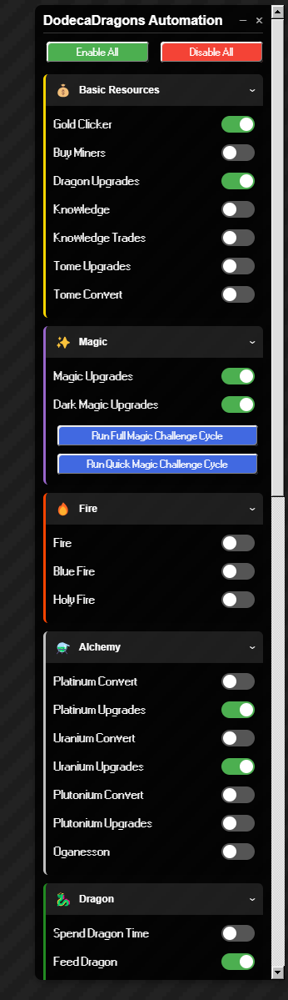
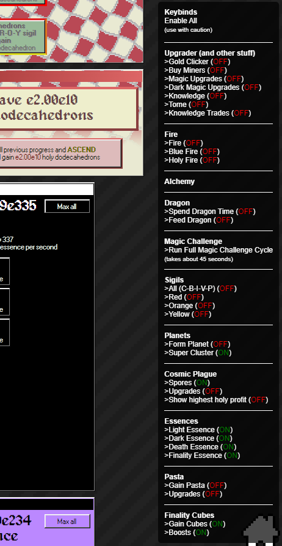

# dodeca dragons helper

[tampermonkey](https://www.tampermonkey.net/) script for the game [dodeca dragons](https://demonin.com/games/dodecaDragons/)

## current

use `script_new.js`



### features

most of the js functions called use `onclick` such as

```
<button style="height: 34px; min-width: 49px" onclick="buyMaxMiners()">Buy<br>max</button>
```

the tampermonkey script is basically a collection of all necessary functions to use with a toggle.

keep in mind, some functions work even though you havent unlocked the respective layer in game yet. its advised to only use toggles for elements of the game youve unlocked but thats up to you.

### installation

go to [tampermonkey](https://www.tampermonkey.net/), create a new script, copy paste the desired script, then save. make sure `@match` in the script actually matches with the url of the game. if done correctly, on dodeca dragons, you should find the script in your tampermonkey extension. with a toggle you can turn it on, then reload the page.

## deprecated

use `script.js`


